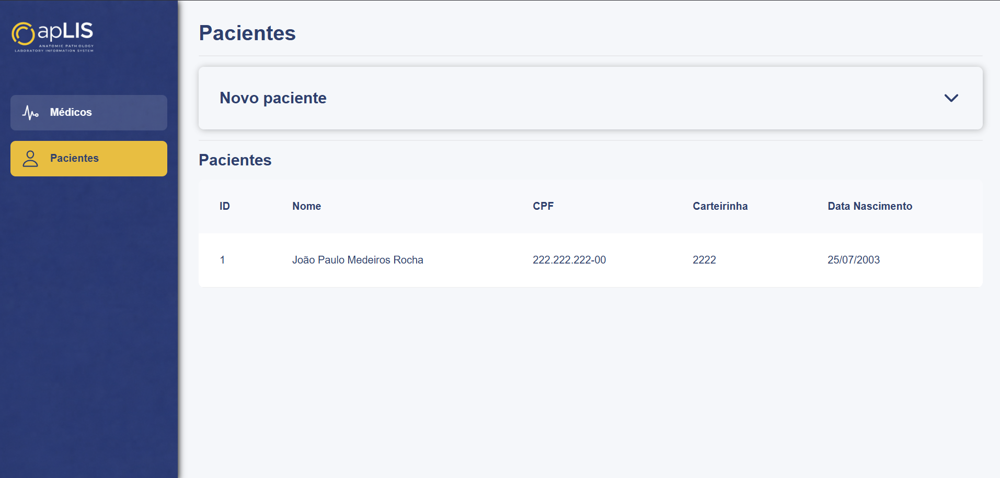
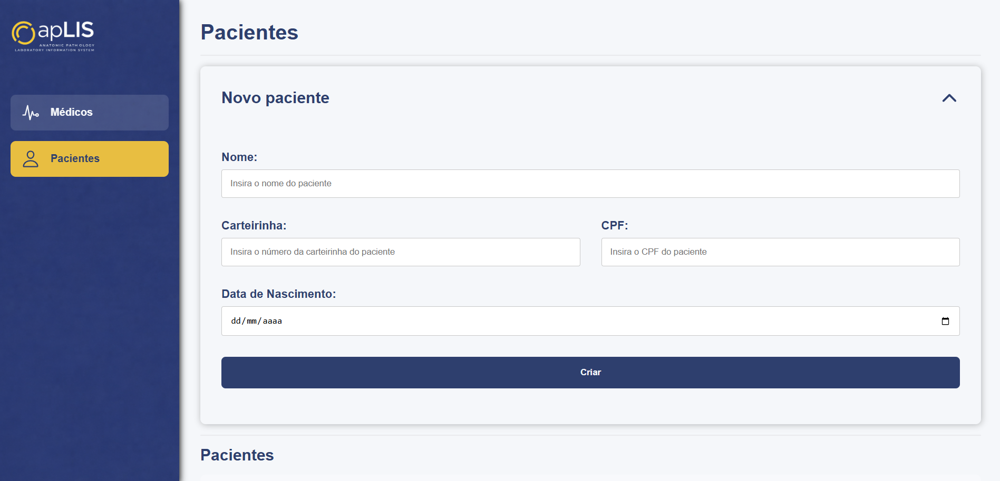
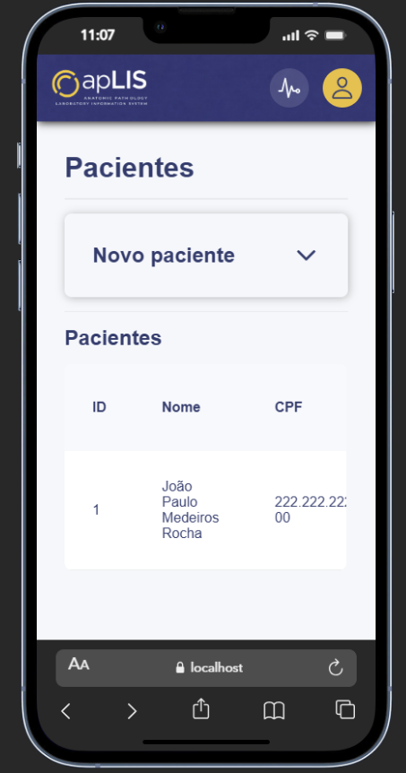
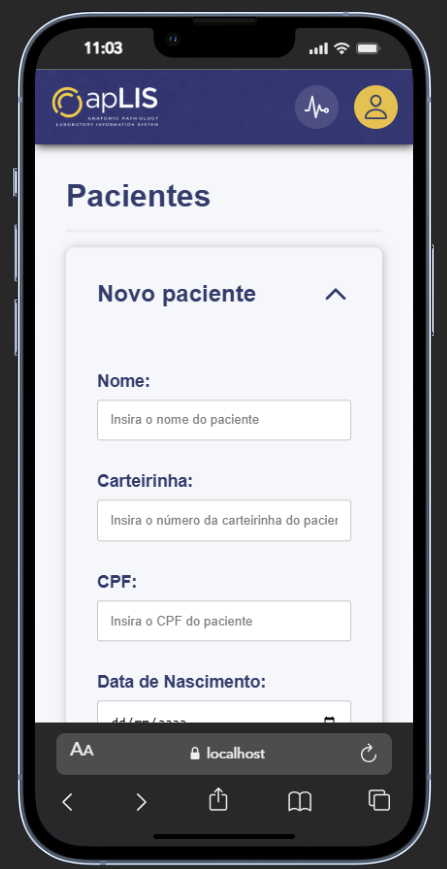
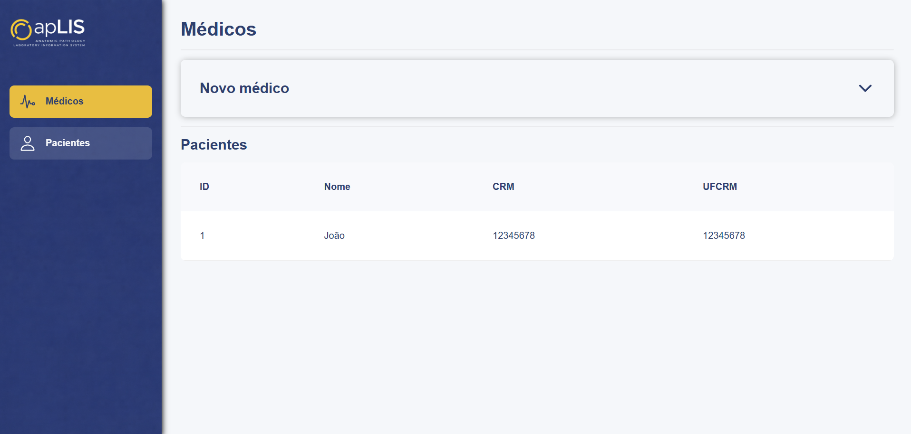
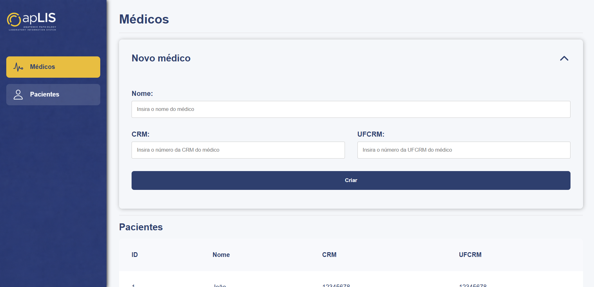
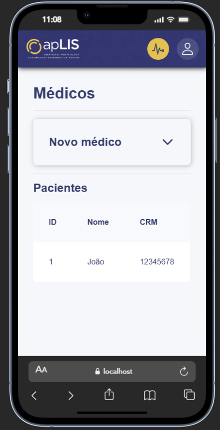
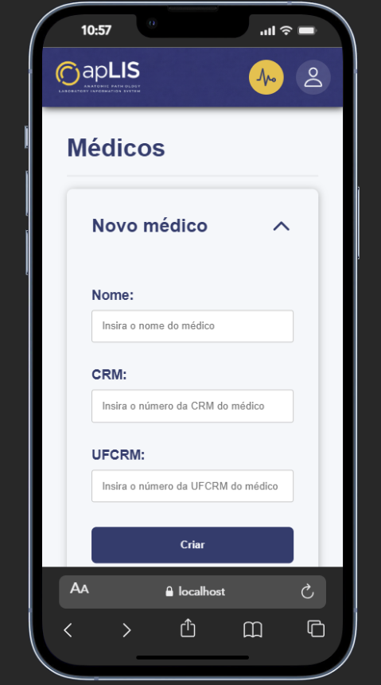

# Solução teste Aplis-desenvolvedor-jr

<br/>
<br/>

# Sobre o projeto

Aplicação Fullstack com:
* Frontend SPA em React
* Backend em PHP (Para gerenciamento de dados de médicos)
* Backend em Node.js (Para gerenciamento de dados de pacientes)
* Banco de dados MySQL

O sistema permite 
* A listagem e cadastro de dados de pacientes
* A listagem e cadastro de dados de médicos

<br />
<br />

# 🖼️ Interface

## Pacientes

### 💻 PC:





<br />

### 📱 Mobile:




<br/>

## Médicos

### 💻PC:





<br />

### 📱 Mobile:





<br />
<br />

# 🧱 Arquitetura

```
app/
├── src/
│   ├── api/                         # Configuração de API
│   │
│   ├── components/                  # Componentes do front
│   │   ├── pages/                   # Páginas de rotas
│   │   └── shared/                  # Componentes compartilhados
│   │
│   ├── layouts/                     # Layouts da aplicação
│   │
│   ├── services/                    # Configuração de serviços de cada API
│   │
│   └── App.jsx                      # Configuração de rotas
│
├── backendjs/
│   ├── config/                      # Configurações gerais
│   │   ├── db_config.js             # Configuração da conexão com o banco de dados
│   │   └── server.js                # Configuração do servidor
│   │
│   └── src/
│       ├── controllers/
│       ├── models/
│       └── routes/                  # Configuração de rotas
│
├── backendphp/
│   ├── src/
│   │   ├── config/
│   │   │   └── DbConfig.php         # Configuração de conexão com o servidor
│   │   │
│   │   ├── controllers/             # Tratamento de dados
│   │   └── repositories/            # Interação direta com o banco
│   │
│   └── index.php                    # Arquivo principal
│
└── db.sql                           # SQL de criação do banco de dados
```

<br />
<br />

# ⚙️ Tecnologias

## Frontend
* React
* Axios
* React Router

## Backend PHP
* PHP (MVC)
* PDO

## Backend Node.js
* Node.js
* Express
* MySQL

## Banco de dados
* MySQL

<br />
<br />

# 🚀 Como rodar o projetor

## 🎲 Banco de dados
Executar o seguinte comando para a criação do banco de dados:
```
CREATE DATABASE aplis;
```

Em seguida, executar o script:
```
/db.sql
```
Para criar e configurar as tabelas

## 🐘 Backend PHP
Abrir o terminal na raiz do projeto e executar os seguintes comandos:
```
cd backendphp    # Para acessar a pasta do servidor
php -S localhost:8000    # Para iniciar o servidor na porta 8000
```

## 🟢 Backend Node.js

Configurar o .env do servidor:
### .env
```
PORT_SERVER = "8080"

DB_HOST = "localhost"
DB_USER = "root="
DB_NAME = nome_do_banco
DB_PASS = senha

```

Após isso abrir o terminal na raiz do projeto e executar os seguintes comandos:
```
cd backendjs    # Para entrar na pasta do servidor
npm install     # Para instalar todas as dependências
node index.js   # Para iniciar o servidor
```


## 🎨 Frontend

Configurar o .env do app:

### .env

```
VITE_API_PATIENTS_URL = "http://localhost:8080/api/v1"
VITE_API_DOCTORS_URL = "http://localhost:8000/api/v1"
```

Após isso abrir o terminal na raiz do projeto e executar os seguintes comandos:

```
cd app      # Para entrar na pasta do app
npm install # Para instalar as dependências
npm run dev # Para iniciar a aplicação
```

<br />
<br />

# 🌐 Endpoints

## Médicos (PHP)
### GET
`/api/v1/medicos`

### POST
`/api/v1/medicos`

Body:
```
{
    "nome": "João",
    "CRM": "12345678"
    "UFCRM": "12345678",
}
```


## Pacientes (Node.js)
### GET
`/api/v1/pacientes`

### POST
`/api/v1/pacientes`

Body:
```
{
    "nome": "João",
    "dataNascimento": "2025-01-01",
    "carteirinha": "12345678"
    "cpf": "123.456.789-09",
}
```

<br />
<br />

# 🧠 Detalhes Técnicos
- Backend estruturado em MVC
- API REST padrão JSON
- Uso de repository para o acesso direto ao banco
- Uso de consign no Node para melhora da configuração do servidor

<br />
<br />

# 👨‍💻Autor
João Paulo Rocha
GitHub: @rochajpp
LinkedIn: https://www.linkedin.com/in/jo%C3%A3o-paulo-medeiros-rocha-75445820b/